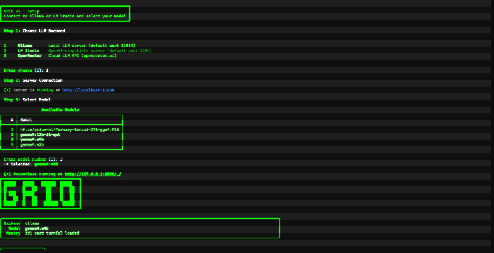
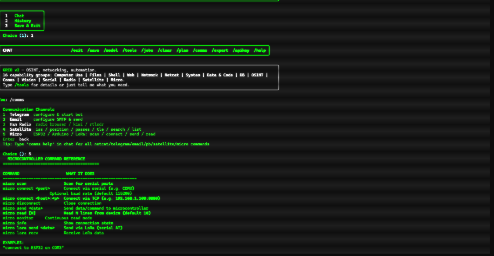
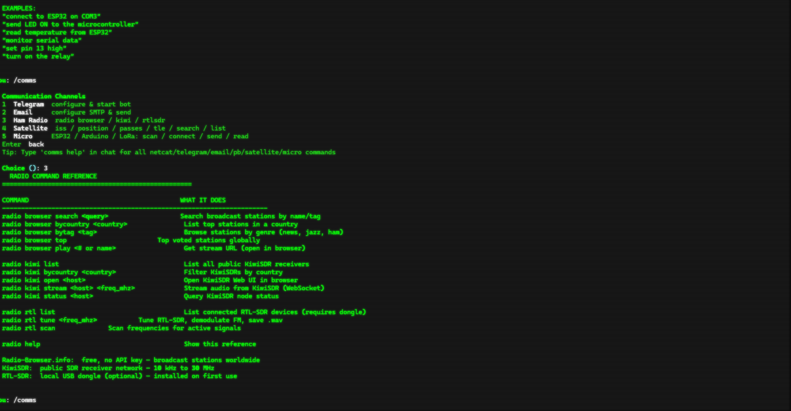
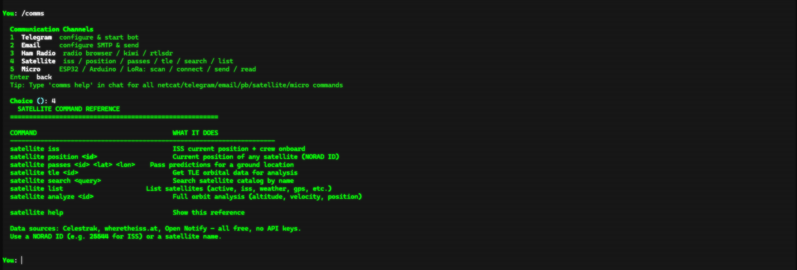

<div align="center">

# GRID v2

### General Reconnaissance & Intelligence Dashboard

*An all-in-one, local-first agent for OSINT, networks, radio, satellites, microcontrollers, computer vision, and automation — with a persistent, human-like memory layer.*

</div>

---

## ✨ What is GRID?

GRID is a self-aware terminal agent that runs fully on your machine. It combines **16 capability groups** — OSINT, network recon, SDR/radio, satellite tracking, microcontroller IoT, computer vision, agent platforms, and automation — under a single conversational interface powered by your local LLM (Ollama), or any OpenAI-compatible backend.

Unlike tool wrappers that live or die on a fixed context window, GRID ships with a **layered memory engine** inspired by modern agent-memory research (e.g. Tencent's 4-tier memory pyramid). It doesn't forget between sessions: it distills what it learns into reusable knowledge instead of drowning in truncated logs.

---

## 🧠 The New: Layered Memory Engine

The latest release adds a real memory system that works across sessions with **zero new dependencies** (DuckDB keyword recall, fully local).

| Layer | What it holds | Where it lives |
|---|---|---|
| **L3 · Persona** | Durable facts & preferences about you | `grid_persona.md` |
| **L2 · Scenarios** | Summaries of completed tasks | DuckDB `memory_scenarios` |
| **L1 · Atoms** | Standalone factual statements | DuckDB `memory_atoms` |
| **L0 · Transcript** | Raw conversation | `memory.md` |
| **Refs** | Full verbatim tool outputs (offloaded) | `refs/<id>.md` |

**How it works:**
- **Every 5 turns**, GRID silently runs one LLM distillation pass over recent history via `Recaller.distill()` — extracting atomic facts, task scenarios, and persona deltas. No feature slice you're still in the middle of gets lost.
- **On every turn**, `_build_messages()` injects the persona plus *only the memories relevant to the current request* (keyword recall) alongside your recent turns — so context stays lean and relevant, not bloated.
- **Tool-output offload**: verbose tool results (>800 chars) are written whole to `refs/`; the model is handed a short preview + a reference id it can pull the full output from on demand — dramatically cutting token usage on long chains.

**Memory commands & tools:**

| Command / Tool | Purpose |
|---|---|
| `/memory` | Show memory stats (atoms / scenarios / refs / persona) |
| `/memory <query>` | Recall memories relevant to a query |
| `/memory clear` | Reset the layered memory store |
| `/ref <id>` | Read a full offloaded tool output |
| `memory_recall` | Tool — search layered memory for context |
| `memory_status` | Tool — memory layer health |
| `ref_read` | Tool — pull an offloaded ref by id |

*Inspired by the layered-memory approach popularised by agent frameworks such as Hermes and OpenClaw and TencentDB Agent Memory — humanlike memory, not a bigger scratchpad.*

---

## 🥊 GRID vs Hermes vs OpenClaw — Why GRID Wins

GRID isn't another messaging tool for one AI. It's the **only agent that fuses a full OSINT / field-ops stack directly to a human-like memory**. Hermes and OpenClaw give you a *chat brain* with toys bolted on — GRID ships as a **recon dashboard, a radio rig, a satellite dish, a camera lab, and a microcontroller bench**, all in one terminal. And it does it with **1 file to run** (`python grid_agent.py`), **zero cloud**, and **68+ built-in tools / 100+ sub-commands**.

| Capability | **GRID (v2) — 68+ tools** | Hermes | OpenClaw |
|---|---|---|---|
| 🧠 **4-tier memory** (persona · scenarios · atoms · offloaded refs) | ✅ built-in, auto-distills every 5 turns | ⚠️ SQLite + user modeling | ⚠️ file-based marks/YAML |
| 🔍 **OSINT** (domain/IP/email/phone/username, dorking, webcam/CCTV) | ✅ **built-in** | ❌ none | ⚠️ web-search only |
| 📡 **Network recon** (Nmap, DNS, netstat, full TCP/UDP netcat suite) | ✅ **built-in** | ❌ none | ⚠️ limited |
| 🎛️ **SDR / HAM radio** (Radio-Browser, KiwiSDR, RTL-SDR) | ✅ **built-in** | ❌ | ❌ |
| 🛰️ **Satellite tracking** (ISS, passes, TLE, catalog) | ✅ **built-in** | ❌ | ❌ |
| 🔌 **Microcontroller IoT** (ESP32/Arduino/LoRa via serial & TCP) | ✅ **built-in** | ❌ | ❌ |
| 👁️ **Computer vision** (OCR, faces, camera validation, video forensics) | ✅ **built-in** | ❌ | ⚠️ visual |
| 🖱️ **Computer use** (mouse, keyboard, screen, typing) | ✅ | ✅ | ✅ |
| 🪞 **Self-authoring skills** | ✅ | ✅ self-improving loop | ✅ 100+ skills |
| 🗄️ **SQL analytics + sync** | ✅ DuckDB + PocketBase | ⚠️ SQLite | ⚠️ SQLite |
| 💬 **Messaging** (Telegram, email, social agent) | ✅ | ✅ first-class | ✅ **first-class** |
| 🚀 **LLM backends** | ✅ Ollama + any OpenAI-compatible | ✅ 200+ via OpenRouter | ✅ 15+ providers |
| 🧾 **Deployment** | ✅ Python, 1 process, local | Node/TS Electron | Python+Node Electron |

### The pitch-line
- **Hermes** is a great *coding agent* — but no OSINT, no network, no radio, no satellites, no vision. For anything past a text editor, **it's a brain with no hands.**
- **OpenClaw** is the best *messaging gateway* — but it's a **heavy Node/Electron app built to babysit chat channels**, not to do field work.
- **GRID alone** packs the **16-capability stack** — OSINT investigation, network ops, SDR capture, ISS passes, ESP32 control, and video forensics — **with memory that remembers who you are across sessions.** All on a slice of a laptop.

**✨ Bottom line —** Hermes writes your code. OpenClaw reads your DMs. **GRID recons the world.** If your work touches *networks, airwaves, orbit, or physical devices*, nothing else comes close.

---

## Requirements

- **Python 3.10+**
- **Ollama** (local LLM) — https://ollama.ai
- **Tesseract OCR** *(optional)* — for image text extraction:
  - `winget install UB-Mannheim.TesseractOCR`
  - or https://github.com/UB-Mannheim/tesseract/wiki

## Quick Start

```bash
# Step 1: Install all dependencies
python install.py

# Step 2: Launch GRID
python grid_agent.py
```

On first launch, select your LLM backend (Ollama), then pick a model.

---

## What's Included

| File | Purpose |
|---|---|
| `grid_agent.py` | Main app — CLI, tool registry, orchestrator, **layered memory** |
| `grid_vision.py` | Computer vision — OCR, face detection, camera validation, video forensics |
| `grid_osint.py` | OSINT engine — domain/IP/email/phone/username intel, camera search, dorking |
| `grid_db.py` | DuckDB layer — tool logging, caching, analytics, **memory tables** |
| `grid_pb.py` | PocketBase integration — cloud sync, artifact upload |
| `grid_satellite.py` | Satellite tracking (ISS, passes, TLE, catalog) |
| `grid_radio.py` | Radio & SDR (Radio-Browser, KiwiSDR, RTL-SDR) |
| `grid_micro.py` | Microcontroller IoT (ESP32, Arduino, LoRa) |
| `grid_skills.py` | Self-authored reusable skills |
| `grid_agent_social.py` | Moltbook social agent platform |
| `grid_google.py` / `grid_sheets.py` | Google Calendar & Sheets / Excel |
| `install.py` | One-time setup — deps, models, config |
| `requirements.txt` | Python package list |
| `GRID_Tools_Test_Guide.docx` | Full user manual + command reference |
| `pocketbase.exe` | PocketBase server (optional, for cloud sync) |

## Screenshots

| | |
|---|---|
|  |  |
|  |  |

---

## Capabilities

- **OSINT** — email/phone/username intelligence, IP/domain enrichment, camera search, Google dorking
- **Network** — ping, DNS, netstat, NMAP scanning, netcat suite (listener/client/scan/proxy/transfer/chat)
- **Computer Vision** — OCR, face detection/comparison, camera-stream validation, video forensics
- **Computer Use** — mouse, keyboard, screenshots
- **Data & Code** — CSV/JSON analysis via pandas, arbitrary Python execution
- **Database** — DuckDB SQL queries, PocketBase sync
- **Memory** — persona, facts, scenarios, offloaded refs, relevance ranking, keyword recall
- **Communication** — Telegram, email
- **System** — hardware info, process management, weather
- **Flight / Satellite / Radio / IoT** — live flight tracking, satellite passes, SDR, microcontrollers

## Recent Changes — Memorable GRID (v2 Memory)

- Added 4-tier layered memory: persona / scenarios / atoms / offloaded refs.
- Automatic 5-turn distillation into long-term knowledge via the local LLM.
- Relevance-based context injection in place of blind last-5-turn truncation.
- Tool-output offload to reduce token usage on long multi-step tasks.
- New tools (`memory_recall`, `memory_status`, `ref_read`) and `/memory`, `/ref` commands.
- Broadened `.gitignore` to keep local memory/config state out of the repo.

## Commands

| Command | Action |
|---|---|
| `/exit` | Save and exit |
| `/back` | Return to main menu |
| `/model` | Switch LLM model |
| `/tools` | View all tools |
| `/clear` | Clear conversation |
| `/plan` | Toggle step-by-step planner mode |
| `/memory [query\|clear]` | View / recall / clear layered memory |
| `/ref <id>` | Read an offloaded tool output |
| `/apikey` | Configure API keys (YouTube, Shodan, VirusTotal, etc.) |
| `/help` | Show command reference |

## Documentation

Open `GRID_Tools_Test_Guide.docx` for the complete user manual, tool descriptions, examples, and quick-reference commands.